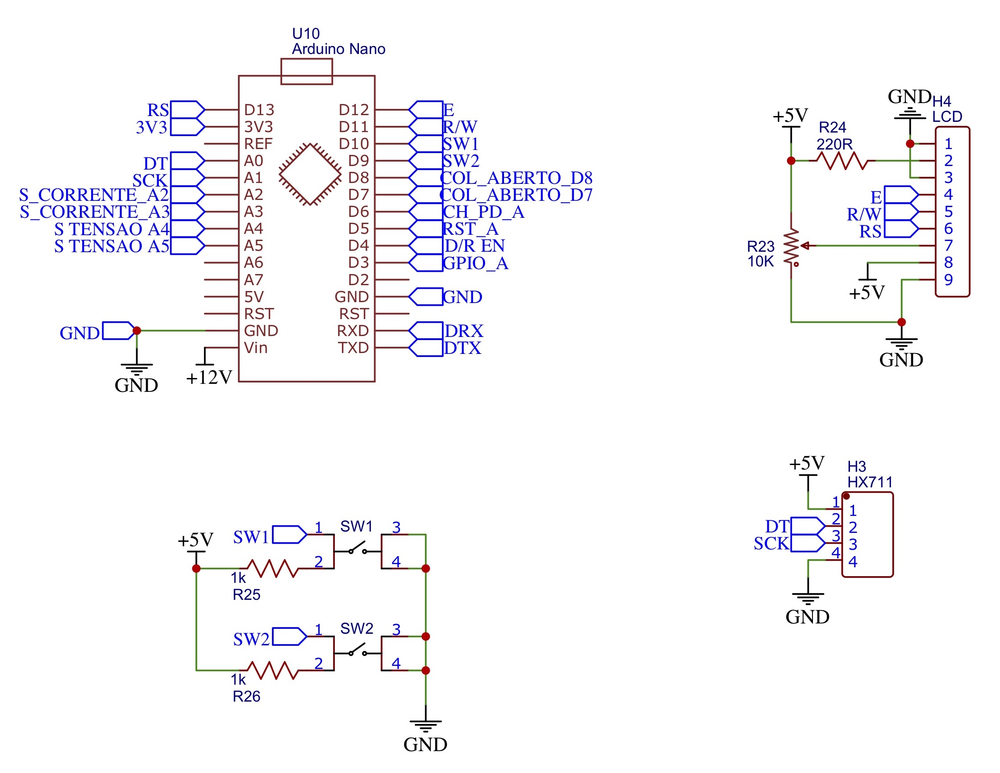
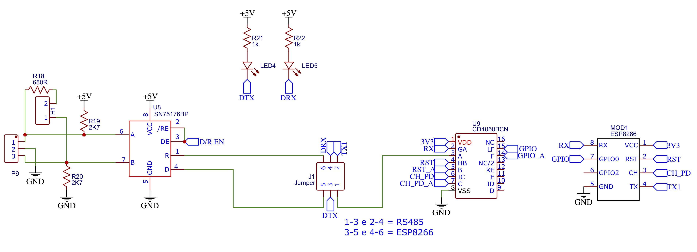
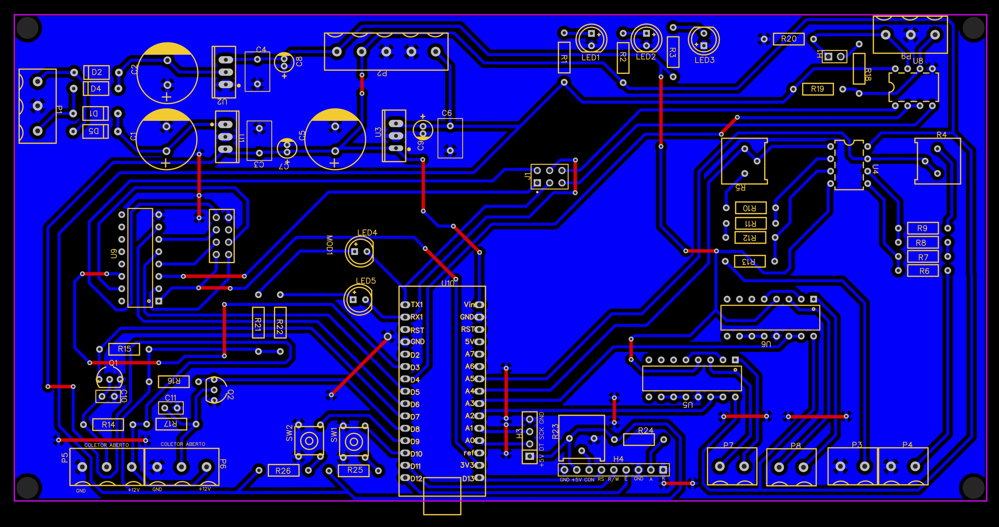
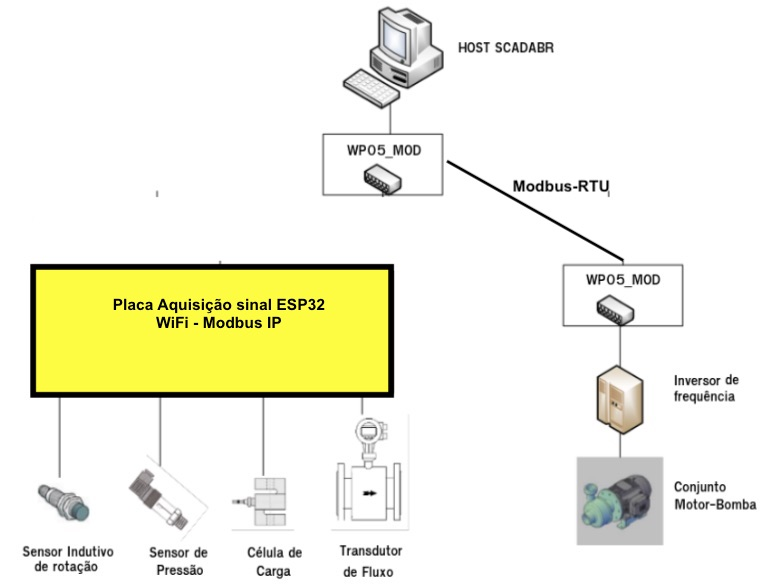

# Laboratório de Sistemas hidrelétricos Faculdade de Engenharia da UnB @ campus Gama 

# 1. Apresentação

O laboratório de sistemas hidrelétricos foi criado em 2010 a partir de um projeto de pesquisa e desenvolvimento financiado pelo CNPq. 
Este projeto chamada "Inovatrans" teve como objetivo avaliar e modelar uma turbina denominada Indalma inventada por um empreendedor na Amazônia e para fazer isso foi desenvolvido uma bancada para fazer o levantamento das características dessa turbina.

Entretanto, buscou-se desenhar a bancada levando em conta a necessidade de um labortaório didático para o curso de engenharia de energia. 
A proposta era de projetar um laboratório o mais realista possível de uma situação real, em contraposição a tendência de práticas laboratóriais baseados em kits didáticos especialmente desenvolvidos para trabalhar alguns conceitos específicos do conteúdo ministrado em sala de aula.

O uso desses kits didáticos específicos tendem a simplificar a complexidade de um sistema de geração e conversão de energia, pois tem a preocupação de ensinar o princípio de funcionamento, mas deixa o tão necessário contato com sistemas reais em segundo plano. 

Essa tendência de simplificação dos laboratórios e um certo afastamento dos sistemas mais reais e complexos nas práticas laboratoriais não é recente e caracteriza uma limitação na formação do engenheiro, que não adquire conhecimento para trabalhar em situações reais que envolvem problemas e desafios constantes. 
Isto é, o estudante perde a possibilidade de entender o processo de conversão de energia no seu conjunto, sendo que poderia experimentar ou aplicar o conteúdo de diversas disciplinas com a mesma instalação laboratorial mais próxima de realidade, analisando e tratando problemas de engenharia com vários níveis de profundidade

Pois, sabe-se que um sistema de conversão de energia em escala reduzida pode ter a mesma complexidade operacional de um sistema real e requer uma infraestrutura apropriada para seu correto funcionamento. 

Por isso o laboratório de sistemas hidrelétricos foi construído com componentes industriais reais disponíveis no mercado com uma configuração mais próximo possível de uma instalação real. 
O laboratório é composto por uma bacada de ensaios onde podem ser testados turbinas hidraulicas. 

A foto da instalação do laboratório mostra a bancada de ensaios (a) e a turbina Indalma (b) e turbina Kaplan (b) que podem ser montados na instalação.

A bancada é composta por circuito hidráulico com reservatório de 1000 litros, bomba de 25CV, tubulação de 8’, 6’ e 4’ com queda de até 7 metros, turbina hidráulica sobre teste, canal de saída com vertedouro triangular. 
O circuito hidráulico foi de tal forma desenhado que é possível programar uma altura constante de coluna d'água por meio das válvulas que transbordem a água para o dreno. 
A vazão da bomba pode ser controlada por meio de um inversor de frequência, permitindo assim um controle mais preciso da pressão da coluna d'água no circuito de adução da turbina. 
A turbina pode ser acoplada a um freio de Prony ou a um gerador elétrico, permitindo a colocar carga mecânica ou elétrica respectivamente.

1. Inversor de frequência WEG 𝐶𝐹𝑊09;
2. Motor WEG, trifásico, 1750𝑅𝑃𝑀, 25𝐶𝑉 , 60𝐻𝑧;
3. Bomba KSB𝐸𝑇𝐴𝑁100−250,𝑄=184,4𝑚3/h,𝐻=21,3𝑚𝑐𝑎; 
4. Turbina Indalma com diâmetro de entrada de saída de 4”;
5. Reservatório de água compacidade de 1000𝑙;
6. Medidores de pressão;
7. Medidor de vazão volumétrica 𝐶𝑂𝑁𝑇𝐸𝐶𝐻 modelo 𝐶𝑇𝐻𝐻𝐷 4”;
8. Vertedor triangular;
9. Células de carga da marca 𝑀𝐾 modelo 𝐶𝑆𝐴/𝑍𝐿 − 20;
10. Sensor indutivo 𝐽𝑁𝐺 modelo 𝐿𝑀 8 − 3002𝑁 𝐴;
11. Válvulas manuais para o sistema de controle de pressão auxiliar.

O laboratório permite a realização de experiências de apoio a diversas disciplinas do curso de engenharia de energia, além de pesquisas a nível de graduação e posgraduação. 
Nos ultimos anos o laboratório tem permitido a produção de 2 trabalhos de iniciação científica, 7 de conclusão de curso e 2 mestrados.

 
# 2. PROPOSTA METODOLÓGICA
O laboratório de sistemas hidrelétricos conta com vários elementos que compõem uma central hidrelétrica em escala reduzida. Visto que cada elemento tem uma função com um nível de complexidade diferente, a proposta é trabalhar em diferentes níveis de acordo com a disciplina que utilize o laboratório.

## 2.1. Primeiro nível: operação manual demonstrativa com instrumentação analógica elementar.
Experiências direcionadas às disciplinas do segundo, terceiro e quarto semestre podendo trabalhar conceitos de fonte de energia, fenômenos de transporte. Este nível inclui a utilização de vertedouro triangular para o cálculo da vazão, cálculo da perda de carga na tubulação e medição de pressão.
Neste nível também é possível aplicar a teoria do balanço de energia, a partir da simplificação da Equação de Bernoulli é possível obter um resultado aproximado para a velocidade e calcular a vazão. Esta análise apresenta o quanto a teoria está perto da realidade e quais são os fatores que interferem para a provável diferença de valores.

## 2.2. Segundo nível: instrumentação para entender e avaliar o comportamento hidrodinâmico da turbina ou circuito de bombeamento.

Experiências direcionadas às disciplinas do quarto e quinto semestre de engenharia (fenômenos de transporte, dinâmica dos fluidos, máquinas de fluxo). Neste nível de complexidade o aluno utiliza uma placa de orifício com sensores de pressão para a medição da vazão, o freio de Prony para obtenção do torque e cálculo da potência da turbina.

## 2.3. Terceiro nível: geração de energia elétrica e sua interligação com a rede de distribuição elétrica.
Experiências direcionadas à disciplinas do quinto, sexto e sétimo semestres. Circuitos elétricos, conversão eletromecânico de energia, transmissão e distribuição de energia.
Neste nível de complexidade o foco das experiências é na conversão eletromecânica de energia elétrica e o uso da eletricidade gerada. Além do processo de conversão, também podem ser trabalhados conceitos ligado a qualidade de energia, como correção de fator de potência e geração distribuída.

## 2.4. Quarto nível: controle de processo e sistemas dinâmicos.
Experiências direcionadas à disciplina de instrumentação e controle de sistemas dinâmicos do sétimo, oitavo e nono semestre de engenharia. A bancada permite o estudo da turbina hidráulica como um sistema de geração que permite que alunos desenvolvam experiências de controle de processo e instrumentação na referida bancada.
Além da modelagem matemática de toda a estrutura do reservatório, conduto forçado e a própria turbina, o sistema elétrico também pode ser modelado e estudado. Serão desenvolvidos dois modelos do conjunto, circuito hidráulico e turbina. Um modelo linear em torno de um ponto de operação do sistema e um modelo não linear. O modelo linear representa o desempenho da turbina a pequenas variações de sinal, onde o aluno poderá reconhecer esses sinais.

[1] Els RH van, SILVA JM da, Araújo BBM, Santander OLS. Laboratório real de geração hidrelétrcia - Proposta de metodológica de utlização de bancada de ensaio de turbina hidráulica no curso de engenharia de energia. XLI Congr. Bras. Educ. em Eng. - COBENGE 2013, Gramada - RS: 2013.

# 3. Instrumentação e sua instalação

O projeto da instrumentação do laboratório de sistemas hidrelétricos também foi desenvolvido para chegar mais próximo a situação real que se possa encontrar na indústria, levando em conta o porte da instalação. 

Os principais variáveis que se precisa ler no sistema são:

* Variáveis hidraulicos (altura da coluna de água, pressão e vazão) 
* Variáveis mecânicos (rotação da turbina e torque)
* Variáveis elétricos (tensão, corrente, potência e fator de potência)

Procurou-se ter 3 planos de instrumentação. 

1. Instrumentação analógia simples
2. Instrumentação eletrônica que permite a leitura independente
3. Instrumentação eletrônica que pode ser integrada num Scada

No primeiro plano de instrumentação analógica simples os instrumentos usados são básicamente, rêgua, balde, cronômetro, balança e contador de pulsos. 

A instrumentação eletrônica usado no segundo e terceiro plano serão apresentados neste capítulo. 

Essa instrumentação eletrônica foi desenvolvido no seguinte trabalho de conclusão de curso: 

Calixto, Rodrigo de O. Sistema Supervisório para Bancada de Ensaio de Picoturbina Hidráulica Indalma. Trabalho de conclusão de curso de Engenharia eletrônica - Universidade de Brasília, 2015.

## 3.1. Pressão

## 3.2. Vazão volumétrica

## 3.3. Sensor de rotação

O sensor de rotacao é baseado num sensor de proximidade indutivo conforem mostrado na figura a seguir.

O sensor de proximidade é do tipo NPN coletor aberto com os seguintes pinos mostrados na fotos a seguir. 

| fio | descrição |  Borne cor da emenda|           
|:----:|:--------:|:---------:|:------:|
| BN - Brown | Alimentação 6-30Vdc | Vermelho| 
| BK - Black | sinal célula | Preto |
| BU - Blue  | GND | Amarelo |

A conversão dos pulsos em velocidade poder ser feito de várias maneiras. 
A maneira mais direto é pelo mostrador WIKA A-RD-1 cuja manual é mostrado a seguir. 

Este mostrador tem vários funcionalidades e pode ser reprogramados para fazer outras funções.

## 3.4. Freio de Prony com célula de carga

Para medir a potência mecânica no eixo desenvolvido pela turbina pode ser usar o Freio de Prony.

O elemento principal do freio é a célula de carga, mostrada na figura a seguir.

Folha de especificação técnica da célula de carga.

[Video de freio de prony montada na bancada](https://youtu.be/LnSO-6u0-hE)

# 4. Sistema de supervisão, controle e  aquisição de dados do laboratório

O sistema de supervisão, controle e  aquisição de dados do laboratório (Supervisory Control and Data Acquisition - SCADA) foi desenhado para integrar todos os elementos do laboratório em uma única plataforma.

Os principais elementos são:

* Computador supervisório
* Placa de aquisição de dados das variáveis hidraulicas e mecânicas 
* Controle e monitoração da bomba hidraulica
* Rede local de comunicação
* Interface de medição e monitoração de variáveis elétricas

Escolheu-se como plataforma de integrar todos estes elementos o software ScadaBR. 
A figura a seguir mostra a primeira configuração do sistema com os seguintes componentes:

1. inversor CFW9 para controle da moto-bomba hidraulica
2. placa de aquisição das variáveis hidraulicas 
3. placa de aquisição das variáveis mecânicas 
4. moto bomba 
5. tubulação de 6"
6. turbulação de 4"
7. turbina Indalma 
8. ambor de freio 
9. célula de carga
10. sensor de vazão
11. interface RS232 para o inversor CFW9
12. interface RS485 para o supervisório 
13. computador supervisório 
14. rede rs485 ligando as placas de aquisição

O diagrama de blocos a seguir mostra o detalhamento dessa configuração.

A interface de medição e monitoramento de variáveis elétricos está sendo desenvolvido. 

As placas para aquirir as variáveis hidraulicas e mecânicas serão apresentado na proxima secção. As duas placas de aquisição são idêntiticas. 

## 4.1. Placa de aquisição de dados

A placa de aquisição de dados foi desenvolvido num trabalho de final de curso de um aluno de engenharia eletrônico e tem como componente principal um microcontrolador Arduino bastante popular. 

O diagrama de blocos é apresentado na figura a seguir, mostrando os blocos funcionais do hardware. Cada placa conta com os seguintes interfaces:

| item | descrição | Interface | Função | pino pcb placa |           
|:----:|:--------:|:---------:|:------:|:----:|
| 1 | Sensor de entrada analógica | 0 - 10 v | ler sinal célula de carga | |
| 2 | Sensor de entrada analógica | 0 - 10 v | ler sinal célula de carga | |
| 3 | Entrada de pulsos           | coletor aberto | ler frequencia |   |    
| 4 | Entrada de pulsos           | coletor aberto | ler frequencia | 2 |   
| 5 | Sensor de loop de corrente  |  4-20mA  |  ler vazão    |  3   |
| 6 | Sensor de loop de corrente  |  4-20mA  |  ler pressão  | 19   | 
| 7 | Sáida para display LCD      | TTL      | mostrar os dados | |
| 8 | Interface de comunicação    | RS485 & WiFi |comunicação como o supervisório |
| 9 | Interface serial digital    | TTL      | conversor ADC |

O diagrama de blocos da placa de aquisição é mostrada na figura a seguir.

O esquema da placa é mostrada nas figuras a seguir. Na primeira figura tem o detalhamento do microcontrolador com as entradas e saídas.

A seguir tem o circuito de comunicação com a opção de selecionar entre RS485 ou WiFi.

A placa de circuito impresso é apresentada na figura a seguir. 

As únicas configurações de hardware na placa é feito pela selação de canal de comunicação (RS485 e WiFi) usando estrapes nos jumpers no J1. 

### 4.1.1. Configuração da placa de aquisição de dados
A placa de aquisição de dados foi inicialmente desenvolvido com uma interface de comunicação RS485 para rodar o protocolo MODBUS-RTU.
Essa opção esbarrou em algumas limitações, pois o MODBUS-RTU com o software ScadaBR não permitia a expansão do sistema devido a uma limitação de implementar várias linhas seriais RS485 no servidor.

Com a amadurecimento da plataforma de instrumentação desenvolveu-se uma nova placa de aquisição, que alem do MODBUS-RTU também podia implementado o protocolo MODBUR-IP e fazer uso da rede de comunicação WiFi no laboratório.

Para implementar as funcionalidades na placa de aquisição com o Arduino Nano usou-se a [biblioteca ESP8266.h](https://github.com/itead/ITEADLIB_Arduino_WeeESP8266)

Para implementar o protocolo MODBUS-IP usou se a biblioteca de [André Sarmento disponível neste link](https://github.com/andresarmento/modbus-arduino)

Alguns problemas que tivemos que resolver para o correto funcionamento do hardware e software. 
Tivemos que corriger alguns bugs da placa, retirando o CD4050, e colocar no lugar dele um divisor de tensão para ligar o TX do Arduio Nano com o RX do ESP8266.
Usamos a configuração mais simples possível de ligar o ESP8266, por meio somente de comandos AT e ligando somente o pino CHE_PD em Vcc, TX e RX do Arduino com RX e TX do ESP8266. 
Outro problema encontrado foi na alimentação VCC do ESP8266 pela saída de 3.3v do Arduino. O consumo do ESP8266 derrubava a saída de 3.3v. 
Por isso teve que se colocar uma fonte de 3.3 exclusivo para alimentar o ESP8266.

Feito isso, desenvolveu-se um programa de habilitar o WiFi no Arduino, e um programa de configuração usando as teclas da placa e o display LCD para configurar o WiFi. 
A novidade neste programa é que, diferentemente das soluções convenconais que usam o Arduino com duas portas seriais, usou-se neste caso somente as teclas e o display para fazer a configuração.
 
O programa está no [repositório](https://github.com/rudivels/Bancada_Hidreletrica) 

O esquemático completo da placa de aquisição está [neste link](figuras/Schematic_Rudi_2020-11-05_23-20-54.pdf)

### 4.1.2. Operação da placa de aquisição de dados

As principais operações na placa de aquisição são:

* ler o estado da rede WiFi
* ler o endereço IP da placa
* reiniciar a rede WiFi

Para fazer isso o programa conta com três teclas do tipo push button e o LCD gráfico de 128x64. 
Durante a operação normal o LCD mostra as variáveis monitorados pela placa e o estado da comunicação. Ao resetar a placa e segurar uma das tecla de programação a placa entre no modo de configuração que permite essas principais operações. 
Pretende-se melhorar essa interface para incluir mais funcionalidades.

## 4.2. ScadaBR 

Diagrama PID 

## 4.3. Rede de comunicação

Rede MODBUS

* MODBUS-IP
* MODBUS-RTU

## 4.4. Controle do pressão da bomba

Santos MECM dos. Controle da pressão de operação da Bancada de Testes para Turbinas Hidráulicas. Trabalho de conclusão de curso de Engenharia de Energia - Universidade de Brasília, 2015.

# 5. Ensaios do segundo nível metodológico - Carga Mecânica
Freio de prony.

## 5.1. Roteiro da experiência remota

# 6. Ensaios do terceiro nível metodológico  - Geração de energia elétrica

 
 

 

# 7. Ensaios do quarto nível metodológico - Controle e sistemas dinâmicos

[1] Santander OLS. Montagem e instrumentação de uma bancada para turbina hidráulica. Dissertação em sistema mecatrônicos - Universidade de Brasília, 2014.

## 7.1. Regulação da geração por meio de controle de valvula de abertura da turbina

[1] Alves KD. Desenvolvimento de regulador de velocidade para Turbina Indalma com sintonia PID baseado em Otimização por Enxame de Partículas ( PSO ). Universidade de Brasília, 2018.

## 7.2. Regulação da geração por meio de controle potência por meio de carga de lastro 

# 8. Bibliografia

## 8.1. Iniciação científica

Els RH van, SILVA JM da, Araújo BBM, Santander OLS. Laboratório real de geração hidrelétrcia - Proposta de metodológica de utlização de bancada de ensaio de turbina hidráulica no curso de engenharia de energia. XLI Congr. Bras. Educ. em Eng. - COBENGE 2013, Gramada - RS: 2013.

Gonçalves JS, Noleto LG, Els RH van. CARACTERIZAÇÃO GEOMÉTRICA E SIMULAÇÃO NUMÉRICA DA DINÂMICA DO ESCOAMENTO DA TURBINA INDALMA - Relatório de Iniciação científica. Universidade de Brasília, Brasília: 2012.

## 8.2. Trabalho de conclusão de curso

[Sloot N, Donald R Mac. Experimental and Numerical Study of the Performance Characteristics of a Pico Hydro Turbine Manufactured By Indalma Industries Inc. Report Bachelor of Science in Mechanical Engineering - Anton de Kom University of Suriname, 2014.](annexos/thesis_Ramsay_Nigel_Final_2014_05_reduzed.pdf)

[Oliveira D dos S. Avaliação Experimental em Modelo Reduzido da Turbina Hidráulica Indalma. Trabalho de conclusão de curso de Engenharia de Energia - Universidade de Brasília, 2014.](annexos/Danilo_TCC2.pdf)

[Calixto R de O. Sistema Supervisório para Bancada de Ensaio de Picoturbina Hidráulica Indalma. Trabalho de conclusão de curso de Engenharia eletrônica - Universidade de Brasília, 2015.](annexos/TCC2_Rodrigo_de_Oliveira_Calixto_090013476.pdf)

Tavares ITB. Influência De Difusor Na Eficiência De Uma Turbina Hidráulica. Trabalho de conclusão de curso em engenharia de energia - Universidade de Brasília, 2014.

[Santos MECM dos. Controle da pressão de operação da Bancada de Testes para Turbinas Hidráulicas. Trabalho de conclusão de curso de Engenharia de Energia - Universidade de Brasília, 2015.](annexos/Maria_Eugenia_TCC2_completo.pdf)

Rocha GB. BANCADA DIDÁTICA PARA TURBINA KAPLAN : PROJETO , CONSTRUÇÃO E ESTUDO EXPERIMENTAL. Trabalho de conclusão de curso de Engenharia de Energia - Universidade de Brasília, 2015.

Rocha JB. Diagnóstico de Vazamentos em Reservatório para Bancada de Ensaios de Turbina Hidráulica. Trabalho de conclusão de curso engenharia de energia - Universidade de Brasília, 2018.

## 8.3. Dissertações de mestrado

Santander OLS. Montagem e instrumentação de uma bancada para turbina hidráulica. Dissertação em sistema mecatrônicos - Universidade de Brasília, 2014.

Alves KD. Desenvolvimento de regulador de velocidade para Turbina Indalma com sintonia PID baseado em Otimização por Enxame de Partículas ( PSO ). Dissertação em sistema mecatrônicos - Universidade de Brasília, 2018.

## 8.4. Artigos em congressos e journais

Els RH van, SILVA JM da, Araújo BBM, Santander OLS. Laboratório real de geração hidrelétrcia - Proposta de metodológica de utlização de bancada de ensaio de turbina hidráulica no curso de engenharia de energia. XLI Congr. Bras. Educ. em Eng. - COBENGE 2013, Gramada - RS: 2013.

Alves KD, Els RH van. LABORATÓRIO DE SISTEMAS HIDRELÉTRICOS APLICADO A FORMACAO DO ENGENHEIRO DE ENERGIA - GERAÇÃO DE ENERGIA ELÉTRICA E CONTROLE DE SISTEMAS DINÂMICOS. XLV Congr. Bras. Educ. em Eng. (COBENGE 2017), Joinville - SC: 2017.

Santander OLS, Silva JM da, ELS RH van. Desenvolvimento de bancada de ensaios de turbina hidráulica. XI Congr. Iberoam. Eng. Mecânica, Argentina: 2013.

Takatsuka JP, Caldeira LG, Oliveira D dos S, Noleto LG, Velasco LN, Els RH Van. Design and Build-Up of a Small Hydroelectric Power Plant for Engineering Teaching. Am J Hydropower, Water Environ Sytems 2017;5:06–10. doi:10.14268/ajhwes.2017.00046.

