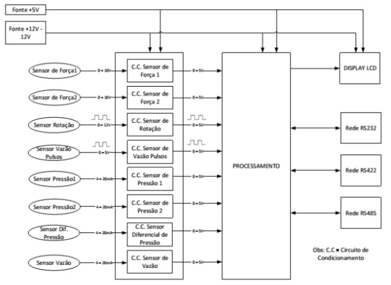

# Laboratório de Sistemas hidrelétricos Faculdade de Engenharia da UnB @ campus Gama 

O laboratório de sistemas hidrelétricos foi criado em 2010 a partir de um projeto de pesquisa e desenvolvimento financiado pelo CNPq. 
Este projeto chamada "Inovatrans" teve como objetivo avaliar e modelar uma turbina denominada Indalma inventada por um empreendedor na Amazônia e para fazer isso foi desenvolvido uma bancada para fazer o levantamento das características dessa turbina.

Entretanto, buscou-se desenhar a bancada levando em conta a necessidade de um labortaório didático para o curso de engenharia de energia. A proposta era de projetar um laboratório o mais realista possível de uma situação real, em contraposição a tendência de práticas laboratóriais baseados em kits didáticos especialmente desenvolvidos para trabalhar alguns conceitos específicos do conteúdo ministrado em sala de aula.

O uso desses kits didáticos específicos tendem a simplificar a complexidade de um sistema de geração e conversão de energia, pois tem a preocupação de ensinar o princípio de funcionamento, mas deixa o tão necessário contato com sistemas reais em segundo plano. 

Essa tendência de simplificação dos laboratórios e um certo afastamento dos sistemas mais reais e complexos nas práticas laboratoriais não é recente e caracteriza uma limitação na formação do engenheiro, que não adquire conhecimento para trabalhar em situações reais que envolvem problemas e desafios constantes. 
Isto é, o estudante perde a possibilidade de entender o processo de conversão de energia no seu conjunto, sendo que poderia experimentar ou aplicar o conteúdo de diversas disciplinas com a mesma instalação laboratorial mais próxima de realidade, analisando e tratando problemas de engenharia com vários níveis de profundidade

Pois, sabe-se que um sistema de conversão de energia em escala reduzida pode ter a mesma complexidade operacional de um sistema real e requer uma infraestrutura apropriada para seu correto funcionamento. 

Por isso o laboratório de sistemas hidrelétricos foi construído com componentes industriais reais disponíveis no mercado com uma configuração mais próximo possível de uma instalação real. 

O laboratório é composto por uma bancada de ensaios de turbinas hidraulicas com circuito hidráulico com reservatório de 1000 litros, bomba de 25CV, tubulação de 8’, 6’ e 4’ com queda de até 7 metros, turbina hidráulica sobre teste, canal de saída com vertedouro triangular. 

A vazão da bomba pode ser controlada por meio de um inversor de frequência, permitindo assim um controle mais preciso da pressão da coluna d'água no circuito de adução da turbina vazão. A turbina está acoplada a um freio de Prony e a um gerador elétrico, permitindo a colocar carga mecânica ou elétrica.

A foto da instalação do laboratório mostra a bancada de ensaios (a) e a turbina Indalma (b) e turbina Kaplan (b) que podem ser montados na instalação.
 
# 1. PROPOSTA METODOLÓGICA
O laboratório de sistemas hidrelétricos conta com vários elementos que compõem uma central hidrelétrica em escala reduzida. Visto que cada elemento tem uma função com um nível de complexidade diferente, a proposta é trabalhar em diferentes níveis de acordo com a disciplina que utilize o laboratório.

## 1.1. Primeiro nível: operação manual demonstrativa com instrumentação analógica elementar.
Experiências direcionadas às disciplinas do segundo, terceiro e quarto semestre podendo trabalhar conceitos de fonte de energia, fenômenos de transporte. Este nível inclui a utilização de vertedouro triangular para o cálculo da vazão, cálculo da perda de carga na tubulação e medição de pressão.
Neste nível também é possível aplicar a teoria do balanço de energia, a partir da simplificação da Equação de Bernoulli é possível obter um resultado aproximado para a velocidade e calcular a vazão. Esta análise apresenta o quanto a teoria está perto da realidade e quais são os fatores que interferem para a provável diferença de valores.

## 1.2. Segundo nível: instrumentação para entender e avaliar o comportamento hidrodinâmico da turbina ou circuito de bombeamento.

Experiências direcionadas às disciplinas do quarto e quinto semestre de engenharia (fenômenos de transporte, dinâmica dos fluidos, máquinas de fluxo). Neste nível de complexidade o aluno utiliza uma placa de orifício com sensores de pressão para a medição da vazão, o freio de Prony para obtenção do torque e cálculo da potência da turbina.

## 1.3. Terceiro nível: geração de energia elétrica e sua interligação com a rede de distribuição elétrica.
Experiências direcionadas à disciplinas do quinto, sexto e sétimo semestres. Circuitos elétricos, conversão eletromecânico de energia, transmissão e distribuição de energia.
Neste nível de complexidade o foco das experiências é na conversão eletromecânica de energia elétrica e o uso da eletricidade gerada. Além do processo de conversão, também podem ser trabalhados conceitos ligado a qualidade de energia, como correção de fator de potência e geração distribuída.

## 1.4. Quarto nível: controle de processo e sistemas dinâmicos.
Experiências direcionadas à disciplina de instrumentação e controle de sistemas dinâmicos do sétimo, oitavo e nono semestre de engenharia. A bancada permite o estudo da turbina hidráulica como um sistema de geração que permite que alunos desenvolvam experiências de controle de processo e instrumentação na referida bancada.
Além da modelagem matemática de toda a estrutura do reservatório, conduto forçado e a própria turbina, o sistema elétrico também pode ser modelado e estudado. Serão desenvolvidos dois modelos do conjunto, circuito hidráulico e turbina. Um modelo linear em torno de um ponto de operação do sistema e um modelo não linear. O modelo linear representa o desempenho da turbina a pequenas variações de sinal, onde o aluno poderá reconhecer esses sinais.

[1] Els RH van, SILVA JM da, Araújo BBM, Santander OLS. Laboratório real de geração hidrelétrcia - Proposta de metodológica de utlização de bancada de ensaio de turbina hidráulica no curso de engenharia de energia. XLI Congr. Bras. Educ. em Eng. - COBENGE 2013, Gramada - RS: 2013.

# 2. Instalação 

A bancada é composta por circuito hidráulico com reservatório de 1000 litros, bomba de 25CV, tubulação de 8’, 6’ e 4’ com queda de até 7 metros, turbina hidráulica sobre teste, canal de saída com vertedouro triangular. O circuito hidráulico foi de tal forma desenhado que é possível programar uma altura constante de coluna d'água por meio das válvulas (a,b,c e d) que transbordem a água para o dreno. A vazão da bomba pode ser controlada por meio de um inversor de frequência , permitindo assim um controle mais preciso da pressão da coluna d'água no circuito de adução da turbina vazão. A turbina está acoplada a um freio de Prony e a um gerador elétrico, permitindo a colocar carga mecânica ou elétrica.

1. Inversor de frequência WEG 𝐶𝐹𝑊09;
2. Motor WEG, trifásico, 1750𝑅𝑃𝑀, 25𝐶𝑉 , 60𝐻𝑧;
3. Bomba KSB𝐸𝑇𝐴𝑁100−250,𝑄=184,4𝑚3/h,𝐻=21,3𝑚𝑐𝑎; 
4. Turbina Indalma com diâmetro de entrada de saída de 4”;
5. Reservatório de água compacidade de 1000𝑙;
6. Medidores de pressão;
7. Medidor de vazão volumétrica 𝐶𝑂𝑁𝑇𝐸𝐶𝐻 modelo 𝐶𝑇𝐻𝐻𝐷 4”;
8. Vertedor triangular;
9. Células de carga da marca 𝑀𝐾 modelo 𝐶𝑆𝐴/𝑍𝐿 − 20;
10. Sensor indutivo 𝐽 𝑁 𝐺 modelo 𝐿𝑀 8 − 3002𝑁 𝐴;
11. Válvulas manuais para o sistema de controle de pressão auxiliar.

# 3. Instrumentação e sua instalação

[1] Calixto R de O. Sistema Supervisório para Bancada de Ensaio de Picoturbina Hidráulica Indalma. Trabalho de conclusão de curso de Engenharia eletrônica - Universidade de Brasília, 2015.

## 3.1. Pressão

## 3.2. Vazão volumétrica

## 3.3. Sensor de rotação

sensor_rotacao

## 3.4. Freio de Prony com célula de carga

## 3.5 Disposição dos instrumentis

# 4. Sistema de aquisição de dados

# 4.1. Rede de comunicação

# 4.2. Placa de aquisição de dados

# 5. Scada 

Diagrama PID 

# 5.1. Controle do pressão da bomba

[1] Santos MECM dos. Controle da pressão de operação da Bancada de Testes para Turbinas Hidráulicas. Universidade de Brasília, 2015.

# 6. Ensaios do segundo nível metodológico - Carga Mecânica
Freio de prony.

# 7. Ensaios do terceiro nível metodológico  - Geração de energia elétrica

 
 

 

# 8. Ensaios do quarto nível metodológico - Controle e sistemas dinâmicos

[1] Santander OLS. Montagem e instrumentação de uma bancada para turbina hidráulica. Dissertação em sistema mecatrônicos - Universidade de Brasília, 2014.

## 8.1. Regulação da geração por meio de controle de valvula de abertura da turbina

[1] Alves KD. Desenvolvimento de regulador de velocidade para Turbina Indalma com sintonia PID baseado em Otimização por Enxame de Partículas ( PSO ). Universidade de Brasília, 2018.

## 8.2. Reguação da geração por meio de controle potência por meio de carga de lastro 

# Bibliografia

[1] Els RH van, SILVA JM da, Araújo BBM, Santander OLS. Laboratório real de geração hidrelétrcia - Proposta de metodológica de utlização de bancada de ensaio de turbina hidráulica no curso de engenharia de energia. XLI Congr. Bras. Educ. em Eng. - COBENGE 2013, Gramada - RS: 2013.

[1] Santander OLS, Silva JM da, ELS RH van. Desenvolvimento de bancada de ensaios de turbina hidráulica. XI Congr. Iberoam. Eng. Mecânica, Argentina: 2013.

[1] Santander OLS. Montagem e instrumentação de uma bancada para turbina hidráulica. Dissertação em sistema mecatrônicos - Universidade de Brasília, 2014.

[1] Calixto R de O. Sistema Supervisório para Bancada de Ensaio de Picoturbina Hidráulica Indalma. Trabalho de conclusão de curso de Engenharia eletrônica - Universidade de Brasília, 2015.

[1] Oliveira D dos S. Avaliação Experimental em Modelo Reduzido da Turbina Hidráulica Indalma. Trabalho de conclusão de curso de Engenharia de Energia - Universidade de Brasília, 2014.

[1] Alves KD. Desenvolvimento de regulador de velocidade para Turbina Indalma com sintonia PID baseado em Otimização por Enxame de Partículas ( PSO ). Dissertação em sistema mecatrônicos - Universidade de Brasília, 2018.

[1] Santos MECM dos. Controle da pressão de operação da Bancada de Testes para Turbinas Hidráulicas. Trabalho de conclusão de curso de Engenharia de Energia - Universidade de Brasília, 2015.

[1] Alves KD, Els RH van. LABORATÓRIO DE SISTEMAS HIDRELÉTRICOS APLICADO A FORMACAO DO ENGENHEIRO DE ENERGIA - GERAÇÃO DE ENERGIA ELÉTRICA E CONTROLE DE SISTEMAS DINÂMICOS. XLV Congr. Bras. Educ. em Eng. (COBENGE 2017), Joinville - SC: 2017.

[1] Sloot N, Donald R Mac. Experimental and Numerical Study of the Performance Characteristics of a Pico Hydro Turbine Manufactured By Indalma Industries Inc. Report Bachelor of Science in Mechanical Engineering - Anton de Kom University of Suriname, 2014.

[1] Takatsuka JP, Caldeira LG, Oliveira D dos S, Noleto LG, Velasco LN, Els RH Van. Design and Build-Up of a Small Hydroelectric Power Plant for Engineering Teaching. Am J Hydropower, Water Environ Sytems 2017;5:06–10. doi:10.14268/ajhwes.2017.00046.